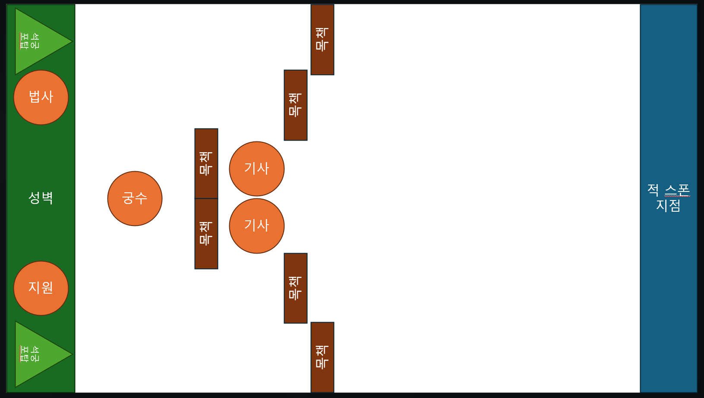

# UI 설계

[← README로 돌아가기](../README.md)

---

## 메인 화면 구성

### 전체 구조 (1280×720)


**3단 레이아웃**
- **상단바**: 유저 정보 + 재화 표시
- **중단**: 부관 일러스트 + 주요 메뉴 (전투/영지/주점/병영)
- **하단바**: 이벤트 배너 + 서브 메뉴 (임무/상점/우편)

### 상세 레이아웃

#### 공통 요소
- **우상단**: 자원 4종 (식량/마석/보급/인력) 상시 표시

#### 메인 로비 화면

**상단바**
| 위치 | 요소 | 기능 |
|------|------|------|
| 좌측 | 유저 정보 | 닉네임, 레벨, 프로필 이미지 |
| 우측 | 자원 4종 | 식량, 마석, 보급, 인력 |
| 우측 | 유료 재화 | 금화 (터치 시 상점 이동) |

**중단 (메인 콘텐츠)**
| 위치 | 요소 | 기능 |
|------|------|------|
| 좌측 | 부관 캐릭터 일러스트 | Live2D 애니메이션 (선택 시 대사) |
| 우측 | 주요 메뉴 버튼 | 전투 / 영지 / 주점 / 병영 (영웅 및 편성 등) |

**하단바**
| 위치 | 요소 | 기능 |
|------|------|------|
| 좌측 | 이벤트 배너 | 슬라이드 배너 (터치 시 이벤트 페이지) |
| 우측 | 서브 메뉴 | 임무 / 상점 / 우편 |


---

## 전투 UI 구조

### 전체 레이아웃



---

## 마나 시스템 UI

### 마나 바 (좌상단)

```
┌──────────────────────────┐
│ 마나: [████████░░░] 10/12  │
│ 회복: 1.5/초               │
└──────────────────────────┘
```

**요소:**
- **마나 게이지**: 현재 마나 / 최대 마나 (시각적 바)
- **수치 표시**: 정확한 마나 수치 (10/12)
- **회복 속도**: 초당 회복량 표시 (1.5/초)
- **갱신**: 실시간 (매 0.1초마다)

### 유닛 배치 UI

```
배치 슬롯 (우상단 또는 우측):

[지원가]        [원거리]       [근접]
배치 비용: 6    배치 비용: 8   배치 비용: 10
현재 마나 충분  현재 마나 충분 현재 마나 부족 ← 회색 처리

아이콘: 밝은 색상  아이콘: 밝은 색상  아이콘: 어두운 색상
버튼: 활성화     버튼: 활성화     버튼: 비활성화
```

**상태 표시:**
- ✓ 마나 충분: 밝은 색상, 버튼 활성화, 터치 가능
- ✗ 마나 부족: 어두운 색상, 버튼 비활성화, 터치 불가능
- 마나 필요량: 각 유닛 아이콘 아래 표시

### 영웅 배치 UI

```
화면 우측 하단:

┌─────────────────┐
│   [영웅 초상화]  │  ← 밝은 이미지 (배치 가능 상태)
│                 │
│  ▶ 배치하기     │  ← 버튼 활성화
└─────────────────┘

[기본 상태]

┌─────────────────┐
│        7        │  ← 타이머 (회수 쿨타임)
│   [영웅 초상화]  │  ← 약간 어두운 이미지
│                 │
│  ▶ 배치 불가    │  ← 버튼 비활성화
└─────────────────┘

[회수 쿨타임 중]

┌─────────────────┐
│       20        │  ← 타이머 (부활 쿨타임)
│   [영웅 초상화]  │  ← 많이 어두운 이미지
│    🔄 복구 중   │  ← "복구 중" 라벨
│  ▶ 배치 불가    │  ← 버튼 비활성화
└─────────────────┘

[부활 쿨타임 중]
```

**상태 표시:**
- 기본 상태: 밝은 이미지, "배치하기" 버튼
- 회수 쿨타임: 약간 어두운 이미지, 7초 타이머, "배치 불가" 표시
- 부활 쿨타임: 매우 어두운 이미지, 20초 타이머, "🔄 복구 중" 라벨

---

## 전투 중 실시간 UI

### 마나 회복 표시

```
마나가 회복될 때 시각적 피드백:
- 마나 바: 매끄러운 애니메이션으로 증가
- 회복 이펙트: 마나 바 옆에 작은 파티클 효과
- 사운드: 가벼운 회복음 (선택사항)
```

### 배치 시 마나 소비 표시

```
유닛 배치 순간:
- 마나 게이지: 급격히 감소 (애니메이션)
- 배치된 유닛: 화면에 나타남 (등장 이펙트)
- 마나 수치: 실시간 업데이트
```

### 영웅 배치/회수 표시

```
영웅 배치 시:
- 배치 버튼 → "배치 불가" (쿨타임 시작)
- 타이머 시작: 7초 카운트다운
- 영웅 이미지: 어두워짐

영웅 회수 또는 사망 시:
- 타이머 표시: 현재 쿨타임 (7초 또는 20초)
- "🔄" 아이콘 표시 (복구 중)
```

---

## 시각 목업

자세한 UI 레이아웃은 [UI 레이아웃](../assets/ui/UI_레이아웃.html) 참조

---

## 관련 문서

- [스테이지 시스템](스테이지%20시스템.md) - 전투 UI 상세, 마나 시스템
- [영웅 시스템](영웅%20시스템.md#배치-시스템) - 영웅 배치 메커니즘
- [스테이지 시스템 - 마나 시스템](스테이지%20시스템.md#마나mana-시스템) - 마나 시스템 상세
- [기술 요구사항](기술%20요구사항.md) - 해상도/스케일
