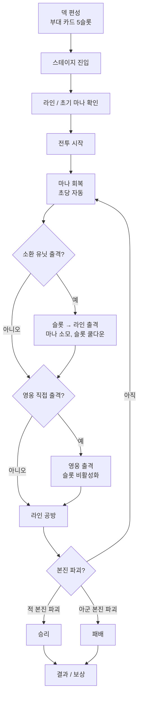

# 스테이지 시스템

[← README로 돌아가기](../README.md)

> 본 문서는 **공방형 라인 디펜스 RPG**의 스테이지 규칙을 정의한다. 전투 정체성/본진/라인의 큰 정의는 [전투 코어](전투%20코어.md), 슬롯 운영의 세부 규칙은 [부대 카드 시스템](부대%20카드%20시스템.md)을 따른다. 본 문서는 두 기준 문서를 전제로 한 **스테이지 레벨의 운용 규칙**만 다룬다.

---

## 1. 개요

- 한 스테이지의 전투는 **공방형 라인 디펜스 RPG**다.
- 양측이 본진을 보유하며, 부대 카드(영웅 + 소환 유닛)를 라인에 출격시켜 **적 본진을 파괴하면 승리**한다.
- 방어선을 일방적으로 막아내는 방어형 타워디펜스가 아니다. 방어 일변도 컨텐츠는 [§10 방어 전용 모드](#10-방어-전용-모드)로 격리한다.
- 세부 슬롯/영웅 출격 규칙은 [부대 카드 시스템](부대%20카드%20시스템.md)을 참조한다.

---

## 2. 전장 구조

### 2.1 라인 구성 (기본)

- **지상 2라인 + 공중 1라인** (Phase 1 기본안)
- 각 라인의 한쪽 끝에 **아군 본진**, 반대쪽 끝에 **적 본진**이 존재한다.
- 라인은 출격한 유닛이 이동하고 교전하는 **경로**다.
- 본 시스템은 "정해진 칸에 유닛을 세우는" 방식이 **아니다.** 슬롯 메인 버튼으로 라인을 선택해 출격시키는 구조다.

```
[공중 라인] ════════════════════════════════════════
[지상 상]   [아군 본진] ───────────────── [적 본진]
[지상 하]   [아군 본진] ───────────────── [적 본진]
```

| 라인 | 특징 | 출격 가능 유닛 |
|------|------|----------------|
| 공중 | 지상 장애물 무시 | 공중 전용 유닛 |
| 지상 상 | 기본 진군 라인 | 지상 유닛 전반 |
| 지상 하 | 기본 진군 라인 | 지상 유닛 전반 |

### 2.2 라인 출격 구조

- 출격은 **라인 단위**다. 라인 안에서의 세부 위치는 시스템이 자동 결정한다.
- 라인 간 이동 허용 여부는 [§11 결정 필요](#11-결정-필요) 참조.
- 라인별 유닛 수 상한, 혼잡 처리 규칙은 임시값으로 두고 후속 결정한다.

---

## 3. 본진 시스템

### 3.1 본진 HP

| 항목 | 설명 |
|------|------|
| **아군 본진 HP** | 스테이지 시작 시 100% (수치 임시값) |
| **적 본진 HP** | 스테이지/적군 구성에 따라 차등 (임시값) |
| **피격 조건** | 적/아군 유닛이 상대 본진에 도달했을 때 자동 공격 |
| **파괴 판정** | HP 0 도달 시 즉시 파괴, 해당 진영 패배 |

### 3.2 본진 자동 공격 / 부속 시설

- 본진이 라인을 향해 자체 공격을 수행하는지, 별도의 부속 자동 공격(구 "성벽 무기" 개념)을 가지는지는 **현 단계에서 확정하지 않는다.**
- 기존 문서에서 다루던 발리스타/투석기/마법 포대 등 **성벽 무기**는 본 기준 개편에서 확정 기능으로 두지 않으며, [§11 결정 필요](#11-결정-필요)에 격리한다.

---

## 4. 마나 시스템

마나는 전투 중 **소환 유닛 출격에 사용되는 단일 자원**이다.

| 항목 | 설명 |
|------|------|
| 회복 | 초당 자동 회복 (수치 임시값) |
| 최대 마나 | 스테이지 / 영지 업그레이드 기준 (수치 임시값) |
| 소모 | 슬롯의 소환 유닛 출격 시 마나 차감 |
| 강화 | [영지 시스템](영지%20시스템.md) 업그레이드로 최대 마나/회복 속도 강화 가능 |

> 마나 수치(최대치, 회복량, 유닛별 비용)는 공방형 구조에 맞춰 재밸런싱이 필요한 임시값이다. 확정 테이블은 별도 데이터 작업에서 정리한다.

### 4.1 영웅 직접 출격의 마나 비용

- 영웅 직접 출격에 마나 비용을 둘지 여부는 **결정 보류** (부대 카드 시스템과 함께 [§11](#11-결정-필요) 참조).

---

## 5. 부대 카드 출격 (요약)

> 본 절은 요약이며, 상세 규칙은 [부대 카드 시스템](부대%20카드%20시스템.md)을 따른다.

- 덱 슬롯 1개 = **영웅 + 소환 유닛 묶음** (= 부대 카드).
- **슬롯 메인 버튼 탭** → 라인 선택 → **소환 유닛 출격** (마나 소모, 슬롯 쿨다운).
- **영웅 초상화 / 별도 버튼 탭** → 라인 선택 → **영웅 직접 출격**.
  - 영웅 출격 중 해당 슬롯은 **비활성화**.
  - 비활성화 상태에서는 동일 슬롯의 소환 유닛을 **추가 소환할 수 없다.**
  - 이미 라인에 출격해 있는 같은 유닛은 **유지**된다.
- 수동 귀환은 짧은 쿨다운, 전투불능은 긴 쿨다운(또는 해당 전투 재출격 불가). 정확한 수치는 [부대 카드 시스템 §3.2](부대%20카드%20시스템.md#32-귀환--전투불능-처리) 참조.

---

## 6. 전투 흐름



### 6.1 단계 요약

1. **덱 편성**: 부대 카드 5슬롯 구성 (메인 화면).
2. **스테이지 진입**: 맵 / 라인 구조 / 적 본진 위치 / 적 출격 패턴 로드.
3. **라인 / 초기 마나 확인**: 라인 수, 본진 위치, 초기 마나, 마나 회복량 표시.
4. **전투 시작**: 마나 회복 타이머 시작.
5. **마나 회복 / 소환 유닛 출격**: 슬롯 메인 버튼으로 라인 출격.
6. **영웅 직접 출격 판단**: 위기/공세 타이밍에 결단.
7. **라인 공방**: 양측 유닛이 라인 위에서 교전, 본진까지 진군.
8. **본진 파괴 / 방어**: 승패 결정.
9. **결과 / 보상**: 별 평가, 보상 정산.

---

## 7. 승리 / 패배 조건

| 구분 | 조건 |
|------|------|
| **승리** | 적 본진 HP 0 |
| **패배** | 아군 본진 HP 0 |
| **시간 초과** | 판정 규칙 [결정 필요](#11-결정-필요) |

- 기존 "모든 웨이브 적 전멸 = 클리어" 규칙은 **본 기준에서 더 이상 기본 승리 조건이 아니다.** 적 전멸은 미니 목표 / 별 평가 가산점으로만 사용한다.
- 기존 "성벽 내구도 0 = 패배" 규칙은 "아군 본진 HP 0 = 패배"로 대체한다.

---

## 8. 스테이지 구성

### 8.1 Phase 1 범위

- 1챕터 5스테이지 ([Phase 1 구현 범위](Phase%201%20구현%20범위.md) 기준).
- 동일 라인 구조(지상 2 + 공중 1) 위에서 적 조합과 출격 패턴 차이로 변별한다.

### 8.2 차별화 축

스테이지마다 다음 축을 조합해 전술 변화를 유도한다.

| 축 | 설명 |
|----|------|
| **라인 압박 분포** | 어느 라인에 적 출격이 집중되는지 |
| **적 조합** | 탱커형 / 돌파형 / 비행형 비중 |
| **보스 등장 타이밍** | 중반/후반 보스 출현, 본진 진군 압박 |
| **적 본진 HP** | 짧고 굵게 끝나는 공세 스테이지 vs 본진이 두꺼운 지구전 |
| **초기 마나 / 회복 속도** | 초반 러시 가능 여부 |

### 8.3 적 출격 패턴 (구 "웨이브")

- 기존 "웨이브"는 본 기준에서 **적 본진이 라인을 향해 유닛을 내보내는 출격 패턴**으로 재정의된다.
- 패턴이 일정 시간 간격 또는 트리거 조건으로 흐른다.
- **웨이브 전멸만으로 클리어되지 않는다.** 적 본진을 파괴해야 한다.
- 적 본진은 잔여 출격 패턴을 모두 소진해도 자체적으로 파괴되지 않는다. 플레이어가 라인을 밀어 본진을 직접 파괴해야 한다.

---

## 9. 스테이지 평가 / 보상

별 평가 기준은 공방형 구조에 맞게 재정의한다. 구체 수치는 임시값 / 결정 필요 단계다.

| 평가 | 기준 후보 (임시) |
|------|------------------|
| ★☆☆ | 스테이지 클리어 (적 본진 파괴) |
| ★★☆ | 클리어 + 아군 본진 HP 일정 % 이상 유지 |
| ★★★ | 클리어 + 본진 HP 유지 + 영웅 전투불능 0 또는 클리어 시간 기준 충족 |

- 기존 "영웅 손실 1링크 이하" 평가는 [링크 시스템](영웅/링크%20시스템.md) 결정과 함께 재검토 대상이다.
- 보상 분배 / 일일 클리어 보너스 등은 본 문서 범위 밖.

---

## 10. 방어 전용 모드

- "방어선을 끝까지 막는다"는 방향의 컨텐츠 (예: 거점 방어, 최후 방어전, 무한 방어전)는 **기본 스테이지 규칙과 분리된 별도 모드**로 다룬다.
- 본 문서가 정의하는 스테이지 규칙(적 본진 파괴 = 승리)은 방어 전용 모드에는 적용되지 않는다.
- 방어 전용 모드의 사양, 등장 시점, 본 코어와의 분리 수준은 [§11 결정 필요](#11-결정-필요)에 둔다.
- 기존 문서의 배치 포인트형 방어 표현은 본 모드 안에서만 한정적으로 재활용할 수 있다.

---

## 11. 결정 필요

- 영웅 직접 출격 마나 비용 여부
- 영웅 전투불능 후 재출격 가능 여부
- 라인 간 이동 허용 여부 (특정 영웅/스킬에 한정?)
- 본진 자동 공격 / 부속 자동 공격 시설 유지 여부 및 도입 시점 (구 "성벽 무기" 처리)
- 시간 초과 시 승패 판정 규칙 (무승부 vs 본진 잔여 HP 비교 vs 패배)
- 방어 전용 모드 사양 및 도입 시점
- 스테이지별 라인 수 가변 허용 시점
- 별 평가 수치 (본진 HP %, 클리어 시간 기준)
- 라인별 유닛 동시 출격 상한 및 혼잡 처리 규칙

---

## 12. 관련 문서

- [전투 코어](전투%20코어.md) - 공방형 라인 디펜스 정의 (Canonical)
- [부대 카드 시스템](부대%20카드%20시스템.md) - 슬롯/영웅 출격 규칙 (Canonical)
- [Phase 1 구현 범위](Phase%201%20구현%20범위.md) - Phase 1 포함/제외 범위 (Canonical)
- [전투 메카닉](전투%20메카닉.md) - 데미지 계산, 속성 상성
- [적 시스템](적%20시스템.md) - 적 유형, 행동 패턴, 보스
- [영웅 시스템](영웅%20시스템.md) - 덱, 역할 분류 (부대 카드 흡수 대상)
- [영지 시스템](영지%20시스템.md) - 마나 강화 업그레이드 연결
- [링크 시스템](영웅/링크%20시스템.md) - 별 평가 재정의 연계
