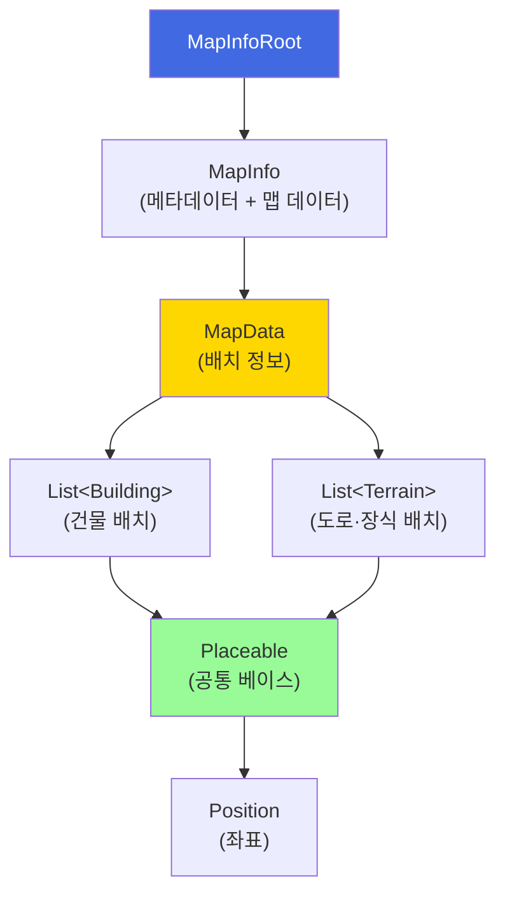

# 데이터 명세

[← 영지 시스템](../영지%20시스템.md)

---

## 1. Enum 정의

### Rotation (건물 방향)

| 값 | 이름 | 설명 |
|----|------|------|
| 0 | NORTH | 북쪽 (위) |
| 90 | EAST | 동쪽 (오른쪽) |
| 180 | SOUTH | 남쪽 (아래) |
| 270 | WEST | 서쪽 (왼쪽) |

### BuildingCategory (건물 분류)

| 값 | 이름 | 설명 |
|----|------|------|
| 0 | PRODUCTION | 생산 시설 (농장, 마력 정제소 등) |
| 1 | HOUSING | 주거 시설 (민가, 연립 주택 등) |
| 2 | COMFORT | 편의 시설 (우물, 방앗간 등) |
| 3 | MILITARY | 군사 시설 (무기고, 공병 작업장 등) |
| 4 | FUNCTION | 기능 시설 (주점, 대장간 등) |
| 5 | DECORATION | 장식 시설 (도로, 가로등 등) |

### BuildingState (건물 상태)

| 값 | 이름 | 설명 |
|----|------|------|
| 0 | BUILDING | 건설 중 |
| 1 | ACTIVE | 활성 (정상 작동) |
| 2 | INACTIVE | 비활성 (작동 중지) |
| 3 | DESTROYED | 파괴됨 |

### ResourceType (자원 종류)

| 값 | 이름 | 설명 |
|----|------|------|
| 0 | SILVER | 은화 |
| 1 | FOOD | 식량 |
| 2 | MANA | 마석 |
| 3 | SUPPLY | 보급 |
| 4 | MANPOWER | 인력 |

### ErrorCode (에러 코드)

| 값 | 이름 | 설명 |
|----|------|------|
| E001 | OUT_OF_BOUNDS | 좌표 범위 초과 |
| E002 | COLLISION | 건물 충돌 |
| E003 | FIXED_AREA | 고정 영역 침범 |
| E004 | NOT_UNLOCKED | 해금 조건 미충족 |
| E005 | MAX_COUNT | 최대 개수 초과 |
| E006 | INVALID_ROTATION | 잘못된 회전 값 |
| E007 | INSUFFICIENT_RESOURCE | 자원 부족 |

### Enum 코드 (C#)

```csharp
public enum Rotation
{
    North = 0,
    East  = 90,
    South = 180,
    West  = 270
}

public enum BuildingCategory
{
    Production  = 0,
    Housing     = 1,
    Comfort     = 2,
    Military    = 3,
    Function    = 4,
    Decoration  = 5
}

public enum BuildingState
{
    Building  = 0,
    Active    = 1,
    Inactive  = 2,
    Destroyed = 3
}

public enum ResourceType
{
    Silver   = 0,
    Food     = 1,
    Mana     = 2,
    Supply   = 3,
    Manpower = 4
}

public enum ErrorCode
{
    None,
    OutOfBounds,
    Collision,
    FixedArea,
    NotUnlocked,
    MaxCount,
    InvalidRotation,
    InsufficientResource,
    MaxLevel
}
```

---

## 2. Config 테이블 (설정 데이터)

> 밸런싱 조정용 테이블. 코드 수정 없이 데이터만 변경하여 조정 가능.
>
> **용도**: 건물/구역 스펙, 게임 밸런스 설정
> **로드 시점**: 로그인 후 (1회)
> **API**: `GET /api/config/all`

### config_manor_building (건물 마스터)

| 컬럼 | 타입 | 설명 |
|------|------|------|
| building_id | VARCHAR(10) | PK (B001 등) |
| building_name | VARCHAR(50) | 건물명 |
| category | VARCHAR(20) | 분류 (production/housing/comfort/military/function/deco) |
| size_x | INT | 가로 크기 |
| size_y | INT | 세로 크기 |
| max_count | INT | 최대 건설 개수 (0=무제한) |
| unlock_castle_level | INT | 해금 필요 영주성 레벨 |
| build_cost | INT | 건설 비용 (은화) |
| demolish_refund_rate | DECIMAL(3,2) | 철거 환급률 (0.5 = 50%) |
| is_default | BOOLEAN | 기본 제공 여부 |

#### 초기 데이터

| building_id | building_name | category | size_x | size_y | max_count | unlock_castle_level | build_cost |
|-------------|---------------|----------|--------|--------|-----------|---------------------|------------|
| B001 | 농장 | production | 2 | 2 | 4 | 1 | 500 |
| B002 | 마력 정제소 | production | 2 | 2 | 3 | 5 | 1000 |
| B003 | 보급창고 | production | 2 | 2 | 3 | 15 | 800 |
| B004 | 훈련소 | production | 2 | 2 | 2 | 30 | 1500 |
| B011 | 민가 | housing | 1 | 1 | 10 | 1 | 100 |
| B012 | 연립 주택 | housing | 1 | 2 | 6 | 5 | 300 |
| B021 | 우물 | comfort | 1 | 1 | 6 | 1 | 50 |
| B022 | 방앗간 | comfort | 2 | 2 | 3 | 5 | 400 |
| B101 | 무기고 | military | 2 | 2 | 1 | 5 | 2000 |
| B201 | 주점 | function | 3 | 2 | 1 | 1 | 0 |

### config_manor_building_level (건물 레벨별 수치)

| 컬럼 | 타입 | 설명 |
|------|------|------|
| building_id | VARCHAR(10) | FK |
| level | INT | 레벨 (1~5) |
| upgrade_cost | INT | 업그레이드 비용 (은화) |
| production_per_hour | INT | 시간당 생산량 (생산 시설) |
| max_storage | INT | 최대 저장량 (생산 시설) |
| population | INT | 인구 (주거 시설) |
| comfort_bonus | DECIMAL(3,2) | 만족도 보너스 (편의 시설) |

**PK: (building_id, level)**

#### 초기 데이터 (농장)

| building_id | level | upgrade_cost | production_per_hour | max_storage |
|-------------|-------|--------------|---------------------|-------------|
| B001 | 1 | 0 | 60 | 500 |
| B001 | 2 | 1000 | 90 | 750 |
| B001 | 3 | 2500 | 130 | 1000 |
| B001 | 4 | 5000 | 180 | 1500 |
| B001 | 5 | 10000 | 250 | 2000 |

#### 초기 데이터 (민가)

| building_id | level | upgrade_cost | population |
|-------------|-------|--------------|------------|
| B011 | 1 | 0 | 2 |
| B011 | 2 | 500 | 3 |
| B011 | 3 | 1200 | 4 |
| B011 | 4 | 2500 | 5 |
| B011 | 5 | 5000 | 6 |

#### 초기 데이터 (우물)

| building_id | level | upgrade_cost | comfort_bonus |
|-------------|-------|--------------|---------------|
| B021 | 1 | 0 | 0.05 |
| B021 | 2 | 300 | 0.07 |
| B021 | 3 | 800 | 0.10 |

### config_manor_castle_level (영주성 레벨별 설정)

| 컬럼 | 타입 | 설명 |
|------|------|------|
| level | INT | PK (1~50) |
| upgrade_cost | INT | 다음 레벨로 업그레이드 비용 (은화) |
| tax_coefficient | DECIMAL(3,2) | 세금 계수 |
| unlock_buildings | TEXT | 해금 건물 ID 목록 (JSON) |
| enable_area_expansion | BOOLEAN | 영역 확장 구매 가능 여부 |

#### 초기 데이터

| level | upgrade_cost | tax_coefficient | unlock_buildings | enable_area_expansion |
|-------|--------------|-----------------|------------------|-----------------------|
| 1 | 1000 | 1.0 | ["B001","B011","B021","B103","B201"] | false |
| 2 | 2000 | 1.0 | [] | false |
| 3 | 3500 | 1.0 | [] | false |
| 4 | 5000 | 1.0 | [] | false |
| 5 | 7000 | 1.1 | ["B002","B012","B022","B101","B202"] | false |
| 10 | 20000 | 1.2 | [] | true |
| 15 | 55000 | 1.3 | ["B003","B013","B023","B024","B102"] | true |
| 25 | 200000 | 1.5 | [] | true |
| 30 | 300000 | 1.8 | ["B004","B025"] | true |
| 40 | 800000 | 2.2 | [] | true |
| 45 | 1250000 | 2.3 | ["B203"] | true |
| 50 | 0 | 2.5 | [] | true |

※ 전체 레벨별 비용은 [세금 시스템](세금%20시스템.md#영주성-레벨업-비용) 참조
※ Lv.50은 최고 레벨이므로 upgrade_cost = 0

### config_manor_terrain (지형 데이터)

> **용도**: 맵 비주얼 렌더링을 위한 지형 정보 (높이맵, 텍스처)
>
> 맵 지형은 고정 데이터로 관리. 플레이어 편집 불가.
> 절차적 메시 생성(`GenerateTerrain`)에 사용.
>
> **구역 테마**: 시작 영역, 평원, 강변, 숲, 습지, 산악, 해안 등 (비주얼 명칭, 게임플레이 효과 없음)

| 컬럼 | 타입 | 설명 |
|------|------|------|
| terrain_id | VARCHAR(10) | PK (T001 등) |
| zone_name | VARCHAR(20) | 구역 테마 명칭 (시작 영역, 평원, 강변 등) |
| size_x | INT | 지형 가로 크기 |
| size_y | INT | 지형 세로 크기 |
| height_data | TEXT(JSON) | 높이 데이터 (size_x * size_y, float 배열) |
| texture_data | TEXT(JSON) | 텍스처 인덱스 (size_x * size_y, int 배열) |

### config_manor_global (전역 설정)

| key | value | description |
|-----|-------|-------------|
| map_size_x | 30 | 맵 가로 크기 |
| map_size_y | 30 | 맵 세로 크기 |
| base_satisfaction | 0.5 | 기본 만족도 (50%) |
| max_satisfaction | 1.5 | 최대 만족도 (150%) |
| offline_max_hours | 24 | 오프라인 생산 최대 시간 |
| castle_size_x | 4 | 영주성 가로 크기 |
| castle_size_y | 4 | 영주성 세로 크기 |
| initial_area_size | 16 | 시작 영역 크기 (영주성 중심 기준 사각형 한 변 길이) |
| area_expansion_cost_base | 100 | 타일 확장 기본 비용 (은화) |
| area_expansion_cost_multiplier | 1.05 | 타일 확장 비용 증가율 (거리당) |
| area_expansion_max_distance | 3 | 기존 영역 기준 최대 확장 거리 (타일) |
| area_expansion_min_width | 2 | 돌출 영역 최소 너비 (타일) |

---

## 3. 서버 DB 스키마

> 유저별 영지 데이터를 서버에 저장하기 위한 데이터베이스 스키마.
> 클라이언트는 이 테이블에 직접 접근하지 않으며, Section 5 API를 통해서만 데이터를 요청/수신.

### 데이터 저장소 계층

| 저장소 | 용도 | 데이터 예시 |
|--------|------|-------------|
| **DB (MySQL/PostgreSQL)** | 영구 저장, 트랜잭션 필요 데이터 | manor_user, manor_building_placement, manor_unlocked_tiles |
| **Redis** | 캐싱, 세션 관리 | Config 캐시, 유저 세션, 마지막 수확 시간 |

**데이터 흐름**:
1. **쓰기**: API → DB 저장 → Redis 캐시 갱신
2. **읽기**: Redis 캐시 확인 → 없으면 DB 조회 → Redis 갱신
3. **생산/세금 계산**: 클라이언트 로컬 계산 (서버 푸시 없음)

---

### manor_user (유저 영지 상태)

| 컬럼 | 타입 | 설명 |
|------|------|------|
| user_id | BIGINT | PK, FK |
| castle_level | INT | 영주성 레벨 (1~50) |
| last_tax_harvest_at | DATETIME | 마지막 세금 수확 시각 (클라이언트 로컬 계산 기준) |
| last_login_at | DATETIME | 마지막 접속 시각 |

### manor_unlocked_tiles (영역 해금)

> 유저별 해금된 타일 목록. 건설 가능한 타일 영역 관리.

| 컬럼 | 타입 | 설명 |
|------|------|------|
| id | BIGINT | PK |
| user_id | BIGINT | 유저 ID (FK) |
| x | INT | X 좌표 (0~29) |
| y | INT | Y 좌표 (0~29) |
| unlocked_at | DATETIME | 해금 시각 |

**인덱스**: (user_id, x, y) UNIQUE

### manor_building_placement (건물 배치)

| 컬럼 | 타입 | 설명 |
|------|------|------|
| id | BIGINT | PK |
| user_id | BIGINT | 유저 ID (FK) |
| building_id | VARCHAR(10) | 건물 ID (FK → config_manor_building) |
| x | INT | X 좌표 (0~맵크기-1) |
| y | INT | Y 좌표 (0~맵크기-1) |
| rotation | INT | 회전 (0, 90, 180, 270) |
| level | INT | 건물 레벨 (1~5) |
| created_at | DATETIME | 건설 시각 |
| updated_at | DATETIME | 수정 시각 |

### manor_building_production (생산 상태)

| 컬럼 | 타입 | 설명 |
|------|------|------|
| id | BIGINT | PK |
| placement_id | BIGINT | 배치 ID (FK) |
| resource_type | VARCHAR(10) | 자원 종류 (food/mana/supply/manpower) |
| last_harvest_at | DATETIME | 마지막 수확 시각 (클라이언트 로컬 계산 기준) |

**NOTE**: `stored_amount` 제거 - 클라이언트가 `last_harvest_at`을 기준으로 로컬 계산

---

## 4. 맵 직렬화 구조 (MapInfo)

> 맵 렌더링을 위한 배치 데이터 (id, typeId, position, rotation).
> 원본: `MapInfo.cs` / `MapInfo.json`
>
> **용도**: 건물/지형 오브젝트 렌더링 (객체 식별, 에셋 선택, 위치/방향)
> **로드 시점**: 영지 진입시 / 건물 배치 변경 시
> **API**: `GET /api/manor/load` (영지 데이터에 포함)

### 클래스 계층 구조



### C# 클래스

```csharp
/// 2D 좌표
[Serializable]
public class Position
{
    public int x;
    public int y;
}

/// 배치 가능한 오브젝트 (공통 베이스)
[Serializable]
public class Placeable
{
    public string id;           // 인스턴스 고유 ID
    public int typeId;          // 타입 ID (config 참조)
    public Position position;   // 배치 좌표
    public Rotation rotation;   // 방향 (0, 90, 180, 270)
}

/// 건물 배치 정보
[Serializable]
public class Building : Placeable { }

/// 지형 배치 정보 (도로, 장식 바닥 등)
[Serializable]
public class Terrain : Placeable { }

/// 맵 데이터 (배치 정보)
[Serializable]
public class MapData
{
    public List<Building> buildings;    // 건물
    public List<Terrain> terrain;       // 도로, 장식 바닥 등
}

/// 맵 정보 (메타데이터 + 맵 데이터)
[Serializable]
public class MapInfo
{
    public string user;          // 유저 ID
    public string description;   // 설명
    public string version;       // 버전
    public DateTime date;        // 생성/수정 일시
    public MapData mapData;      // 실제 맵 데이터
}

/// JSON 루트 (직렬화용)
[Serializable]
public class MapInfoRoot
{
    public MapInfo mapinfo;
}
```

### 필드 설명

| 클래스 | 필드 | 타입 | 설명 |
|--------|------|------|------|
| **Position** | x | int | X 좌표 |
| | y | int | Y 좌표 |
| **Placeable** | id | string | 인스턴스 고유 ID (`main_castle_001` 등) |
| | typeId | int | 타입 ID (config 참조, 101=영주성, 102=병영 등) |
| | position | Position | 배치 좌표 |
| | rotation | Rotation | 방향 (North=0, East=90, South=180, West=270) |
| **MapData** | buildings | List\<Building\> | 건물 배치 목록 |
| | terrain | List\<Terrain\> | 도로·장식 바닥 배치 목록 |
| **MapInfo** | user | string | 유저 ID |
| | description | string | 맵 설명 |
| | version | string | 데이터 버전 |
| | date | DateTime | 생성/수정 일시 (ISO 8601) |
| | mapData | MapData | 건물 + 지형 배치 목록 |

### JSON 직렬화 예시 (MapInfo.json)

```json
{
    "mapinfo": {
        "user": "temp1",
        "description": "영지 데이터.",
        "version": "1.0",
        "date": "2024-06-01T00:00:00Z",
        "mapData": {
            "buildings": [
                {
                    "id": "main_castle_001",
                    "typeId": 101,
                    "position": { "x": 0, "y": 0 },
                    "rotation": 180
                },
                {
                    "id": "barracks_001",
                    "typeId": 102,
                    "position": { "x": 10, "y": 5 },
                    "rotation": 90
                },
                {
                    "id": "market_001",
                    "typeId": 103,
                    "position": { "x": -5, "y": 15 },
                    "rotation": 0
                },
                {
                    "id": "farm_001",
                    "typeId": 104,
                    "position": { "x": 20, "y": -10 },
                    "rotation": 270
                }
            ],
            "terrain": [
                {
                    "id": "road_001",
                    "typeId": 501,
                    "position": { "x": 1, "y": 0 },
                    "rotation": 0
                },
                {
                    "id": "road_002",
                    "typeId": 501,
                    "position": { "x": 2, "y": 0 },
                    "rotation": 0
                }
            ]
        }
    }
}
```

---

## 5. API 명세

### Config 데이터 로드

> **시점**: 로그인 후 (1회)
> **용도**: 건물/구역 스펙, 게임 설정 로드

```
GET /api/config/all
{
  buildings: [ /* config_manor_building 데이터 */ ],
  terrain: [ /* config_manor_terrain 데이터 */ ],
  global: { /* config_manor_global 데이터 */ }
}
```

---

### 장원 데이터 로드

> **시점**: 장원 진입 시
> **용도**: MapInfo (맵 렌더링) + 장원 상태 (자원, 생산 정보 등) 로드

```
GET /api/manor/load
{
  mapInfo: {
    user: "user123",
    version: "1.0",
    date: "2024-06-01T00:00:00Z",
    mapData: {
      buildings: [
        { id: "main_castle_001", typeId: 101, position: { x: 0, y: 0 }, rotation: 180 },
        { id: "farm_001", typeId: 104, position: { x: 20, y: -10 }, rotation: 270 }
      ],
      terrain: [
        { id: "road_001", typeId: 501, position: { x: 1, y: 0 }, rotation: 0 }
      ]
    }
  },
  manor: {
    silver: 1000,
    food: 500,
    mana: 200,
    supply: 150,
    manpower: 50,
    population: 120,
    satisfaction: 0.85,
    tax_rate: 0.15
  },
  unlockedTiles: [
    { x: 13, y: 13 },
    { x: 13, y: 14 },
    { x: 14, y: 13 },
    { x: 14, y: 14 }
    // ... 시작 영역 + 구매한 타일 목록
  ],
  buildings: [
    {
      id: "farm_001",
      level: 3,
      state: "active",
      last_harvest_at: "2024-06-01T12:00:00Z"  // 클라이언트가 이 값으로 로컬 계산
    }
  ]
}
```

---

### 클라이언트 로컬 생산 계산

> **시점**: 클라이언트가 매 프레임/초마다
> **용도**: 생산량 UI 실시간 업데이트 (서버 푸시 없음)

**클라이언트 로직 예시**:
```csharp
// 매 초마다 UI 업데이트
public void UpdateProductionUI()
{
    foreach (var building in buildings)
    {
        var config = GetBuildingConfig(building.id);
        var levelData = config.levels[building.level];

        // 경과 시간 계산
        float elapsedSeconds = (DateTime.Now - building.lastHarvestAt).TotalSeconds;

        // 생산량 계산
        float productionRate = levelData.productionPerHour * satisfaction;
        float produced = (productionRate / 3600f) * elapsedSeconds;
        float current = Mathf.Min(produced, levelData.maxStorage);

        // UI 업데이트
        UpdateBuildingDisplay(building.id, current, levelData.maxStorage);
    }
}
```

**NOTE**: 서버는 생산 진행 상태를 추적하지 않음. 수확 시에만 서버 검증.

---

### 건물 배치

> **시점**: 요청 시
> **용도**: 새 건물 배치

```
POST /api/manor/building/place
{
  building_id: "B001",
  x: 5,
  y: 7,
  rotation: 0
}

Response:
{
  success: true,
  placement_id: 124,
  mapInfo: { /* 업데이트된 MapInfo */ }
}
```

---

### 건물 이동

> **시점**: 요청 시
> **용도**: 기존 건물 위치 변경

```
POST /api/manor/building/move
{
  placement_id: 123,
  x: 8,
  y: 10,
  rotation: 90
}

Response:
{
  success: true,
  mapInfo: { /* 업데이트된 MapInfo */ }
}
```

---

### 자원 수확

> **시점**: 요청 시
> **용도**: 클라이언트 로컬 계산 → 서버 검증 및 자원 지급

```
POST /api/manor/harvest
{
  placement_id: 123
}

Response:
{
  success: true,
  harvested: {
    resource: "food",
    amount: 120  // 서버에서 재계산된 값 (최종 권한)
  },
  last_harvest_at: "2024-06-01T13:00:00Z",  // 갱신된 수확 시간
  manor: {
    food: 1120  // 업데이트된 자원
  }
}

POST /api/manor/harvest-all
{}

Response:
{
  success: true,
  harvested: [
    {
      placement_id: 1,
      building_id: "farm_001",
      resource: "food",
      amount: 120,
      last_harvest_at: "2024-06-01T13:00:00Z"
    },
    {
      placement_id: 2,
      building_id: "farm_002",
      resource: "food",
      amount: 95,
      last_harvest_at: "2024-06-01T13:00:00Z"
    },
    {
      type: "tax",
      resource: "silver",
      amount: 58,
      last_harvest_at: "2024-06-01T13:00:00Z"
    }
  ],
  manor: {
    food: 1215,  // 업데이트된 자원
    silver: 1058
  }
}
```

**NOTE**: 서버가 경과 시간 기반으로 재계산하여 최종 금액 결정. 클라이언트 계산과 차이가 있을 수 있음.

---

### 건물 업그레이드

> **시점**: 요청 시
> **용도**: 건물 레벨 증가

```
POST /api/manor/building/upgrade
{
  placement_id: 123
}

Response (성공):
{
  success: true,
  building: {
    placement_id: 123,
    level: 2,
    upgrade_cost: 1000
  },
  manor: {
    silver: 4000  // 비용 차감 후
  }
}

Response (실패 - 최대 레벨):
{
  success: false,
  error: "MAX_LEVEL",
  message: "이미 최대 레벨입니다."
}

Response (실패 - 자원 부족):
{
  success: false,
  error: "INSUFFICIENT_RESOURCE",
  message: "은화가 부족합니다."
}
```

---

### 건물 철거

> **시점**: 요청 시
> **용도**: 건물 제거 및 비용 환급

```
POST /api/manor/building/demolish
{
  placement_id: 123
}

Response (성공):
{
  success: true,
  refund: 250,  // 환급 금액 (건설 비용의 50%)
  mapInfo: { /* 업데이트된 MapInfo */ },
  manor: {
    silver: 4250  // 환급 후
  }
}

Response (실패 - 철거 불가):
{
  success: false,
  error: "CANNOT_DEMOLISH",
  message: "이 건물은 철거할 수 없습니다."
}
```

---

### 영주성 레벨업

> **시점**: 요청 시
> **용도**: 영주성 레벨 증가, 새로운 건물/기능 해금

```
POST /api/manor/castle/upgrade
{}

Response (성공):
{
  success: true,
  castle: {
    level: 6,
    upgrade_cost: 7000,
    tax_coefficient: 1.1,
    unlocked_buildings: []
  },
  manor: {
    silver: 3000  // 비용 차감 후
  }
}

Response (성공 - 건물 해금 시):
{
  success: true,
  castle: {
    level: 5,
    upgrade_cost: 7000,
    tax_coefficient: 1.1,
    unlocked_buildings: ["B002", "B012", "B022", "B101", "B202"]
  },
  manor: {
    silver: 5000
  },
  message: "새로운 건물이 해금되었습니다!"
}

Response (실패 - 최대 레벨):
{
  success: false,
  error: "MAX_LEVEL",
  message: "이미 최대 레벨입니다."
}

Response (실패 - 자원 부족):
{
  success: false,
  error: "INSUFFICIENT_RESOURCE",
  message: "은화가 부족합니다."
}
```

---

### 영역 확장 (타일 해금)

> **시점**: 요청 시
> **용도**: 새 타일 구매 (영역 확장)

```
POST /api/manor/area/unlock
{
  x: 10,
  y: 15
}

Response (성공):
{
  success: true,
  cost: 150,
  unlockedTiles: [
    { x: 10, y: 15 }
  ],
  manor: {
    silver: 850  // 비용 차감 후
  }
}

Response (실패 - 인접하지 않음):
{
  success: false,
  error: "NOT_ADJACENT",
  message: "기존 영역에 인접한 타일만 확장 가능합니다."
}

Response (실패 - 거리 제약):
{
  success: false,
  error: "TOO_FAR",
  message: "기존 영역에서 너무 멀리 떨어져 있습니다."
}

Response (실패 - 레벨 부족):
{
  success: false,
  error: "LEVEL_REQUIRED",
  message: "영주성 레벨 10 이상 필요합니다."
}

Response (실패 - 자원 부족):
{
  success: false,
  error: "INSUFFICIENT_RESOURCE",
  message: "은화가 부족합니다."
}
```

---

## 관련 문서

- [데이터 테이블](../데이터%20테이블.md) - 전체 시스템 데이터 구조
- [데이터 아키텍처](../데이터%20아키텍처.md) - DB/Redis 저장소 계층
- [맵·구역 시스템](맵·구역%20시스템.md) - 격자 스펙, 영역 확장
- [건물 목록](건물%20목록.md) - 건물 스펙, 영주성 해금표
- [건설 시스템](건설%20시스템.md) - 배치 플로우, 충돌 검사
- [생산 시스템](생산%20시스템.md) - 생산 공식, 수확 규칙
