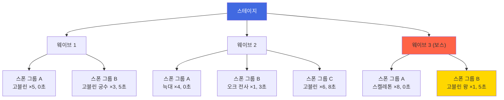

# 적 시스템

[← README로 돌아가기](../README.md)

---

## 개요

플레이어가 상대하는 모든 적 엔티티의 유형, 스탯, 행동 패턴을 정의합니다. 적은 스테이지 우측에서 출현하여 성벽을 향해 진행하며, 아군을 공격합니다.

---

## 적 분류

### 등급

| 등급 | 설명 | 출현 빈도 |
|------|------|-----------|
| 일반 | 기본 적 유닛, 대량 출현 | 매우 높음 |
| 정예 | 강화된 적, 특수 능력 보유 | 중간 |
| 보스 | 웨이브/스테이지 보스, 고유 패턴 | 낮음 (웨이브 마지막) |

### 종족

| 종족 | 특징 | 예시 |
|------|------|------|
| 마수 | 물리 위주, 높은 HP | 고블린, 오크, 늑대 |
| 마법체 | 마법 위주, 높은 RES | 슬라임, 위습, 유령 |
| 기계 | 높은 DEF, 낮은 RES | 골렘, 공성병기 |
| 비행 | 지상 장애물 무시 | 와이번, 가고일, 하피 |
| 언데드 | 부활/재생 특수 효과 | 스켈레톤, 좀비 |

---

## 행동 패턴

### 이동 패턴

| 패턴 | 설명 | 적용 유형 |
|------|------|-----------|
| 직진 | 성벽을 향해 최단 경로 이동 | 일반 (기본) |
| 우회 | 측면으로 돌아서 접근, 빈 경로 탐색 | 정예 일부 |
| 돌파 | 높은 MOV로 전선 관통 | 정예 (돌격형) |
| 비행 | 지상 장애물(목책 등) 무시, 직선 이동 | 비행 종족 |

### 공격 패턴

| 패턴 | 설명 | 적용 유형 |
|------|------|-----------|
| 근접 | 인접 타일에서 물리 공격 | 마수, 기계, 언데드 |
| 원거리 | 일정 거리에서 투사체 공격 | 마법체, 궁수형, 비행 일부 |
| 자폭 | 사망 시 주변 범위 피해 | 폭탄형 특수 |
| 소환 | 하위 유닛 소환 | 보스 전용 |

### 특수 행동

| 행동 | 설명 | 적용 유형 |
|------|------|-----------|
| 성벽 집중 | 아군 무시, 성벽만 공격 | 공성형 |
| 은신 | 일정 거리까지 타겟 불가 | 암살형 정예 |
| 부활 | 사망 후 1회 부활 (HP 일부 회복) | 언데드 정예 |
| 광폭 | HP 일정 이하 시 ATK/SPD 증가 | 정예/보스 |

---

## 적 스탯 구조

> [스탯 시스템](스탯%20시스템.md)의 엔티티 공통 구조를 따름

### 기본 스탯

| 스탯 | 설명 | 일반 | 정예 | 보스 |
|------|------|------|------|------|
| HP | 체력 | 보통 | 높음 | 매우 높음 |
| ATK | 물리 공격력 | 보통 | 높음 | 높음 |
| MAG | 마법 공격력 | 낮음~보통 | 보통~높음 | 높음 |
| **WGT** | **무게 (넉백 저항)** | **계산값** | **계산값** | **계산값** |

### 무게(Weight) 스탯

```
계산식: WGT = (HP + DEF × 2) / 10 [반올림]

특징:
- 체력과 방어력 모두에 영향받음
- 높은 HP/DEF → 무거움 → 넉백 저항
- 낮은 HP/DEF → 가벼움 → 잘 밀림

예시:
- 고블린: (150 + 10×2) / 10 = 17 (가벼움)
- 오크 전사: (300 + 25×2) / 10 = 35 (중간)
- 골렘: (800 + 60×2) / 10 = 92 (매우 무거움)
```

**참조:**
- [전투 메카닉 - 무게 스탯](전투%20메카닉.md#무게weight-스탯)
- [전투 메카닉 - 넉백 거리 계산](전투%20메카닉.md#넉백-거리-계산)
| DEF | 물리 방어력 | 낮음 | 보통 | 높음 |
| RES | 마법 방어력 | 낮음 | 보통 | 높음 |
| SPD | 공격속도 | 보통 | 보통 | 보통 |
| MOV | 이동속도 | 보통 | 다양 | 느림 |
| RNG | 사거리 | 1 (근접) | 다양 | 다양 |
| WGT | **무게** | **계산** | **계산** | **계산** |

### 스탯 스케일링

스테이지가 진행될수록 적 스탯이 증가:

```
적 스탯 = 기본값 × (1 + 스테이지 계수)
```

| 챕터 | 스테이지 계수 |
|------|---------------|
| 1 | 0.0 ~ 0.2 |
| 2 | 0.3 ~ 0.5 |
| 3 | 0.6 ~ 1.0 |
| 4+ | 1.0+ |

---

## 적 유형 예시 (Phase 1)

### 일반 적

| ID | 이름 | 종족 | 이동 | 공격 | 특징 |
|----|------|------|------|------|------|
| E001 | 고블린 | 마수 | 직진 | 근접 | 기본 적, 낮은 스탯 |
| E002 | 고블린 궁수 | 마수 | 직진 | 원거리 | 낮은 HP, 원거리 공격 |
| E003 | 늑대 | 마수 | 직진 | 근접 | 높은 MOV, 낮은 HP |
| E004 | 슬라임 | 마법체 | 직진 | 근접 | 높은 RES, 낮은 DEF |
| E005 | 스켈레톤 | 언데드 | 직진 | 근접 | 보통 스탯 |

### 정예 적

| ID | 이름 | 종족 | 이동 | 공격 | 특수 |
|----|------|------|------|------|------|
| E101 | 오크 전사 | 마수 | 직진 | 근접 | 광폭 (HP 30% 이하 시 ATK +50%) |
| E102 | 돌격 기병 | 마수 | 돌파 | 돌진 | 높은 MOV, 전선 관통 |
| E103 | 위습 | 마법체 | 우회 | 원거리 | 마법 공격, 빈 경로 탐색 |
| E104 | 가고일 | 비행 | 비행 | 근접 | 목책 무시, 직선 이동 |
| E105 | 골렘 | 기계 | 직진 | 근접 | 매우 높은 DEF/HP, 매우 낮은 MOV |

### 보스 적

| ID | 이름 | 종족 | 특수 능력 |
|----|------|------|-----------|
| B001 | 고블린 왕 | 마수 | 주변 일반 적 버프 (ATK +20%), 소환 |
| B002 | 리치 | 언데드 | 원거리 마법, 주변 스켈레톤 부활 |

---

## 보스 메카닉

### 공통 규칙

- 보스는 스테이지 마지막 웨이브에 출현
- 보스는 스턴/빙결 등 행동불가 효과 지속시간 50% 감소
- 보스 사망 시 해당 웨이브의 남은 일반 적도 전멸 처리

### 페이즈 시스템 (Phase 2+)

| 페이즈 | 조건 | 변화 |
|--------|------|------|
| 1 | HP 100~50% | 기본 패턴 |
| 2 | HP 50% 이하 | 강화 패턴 (ATK/SPD 증가, 추가 스킬) |

---

## 웨이브 구성

### 웨이브 구조

하나의 스테이지는 여러 웨이브로 구성되며, 각 웨이브는 스폰 그룹의 집합.



### 스폰 규칙

| 항목 | 설명 |
|------|------|
| 스폰 위치 | 맵 우측 적 출현 영역 (여러 줄 분산) |
| 스폰 딜레이 | 그룹 내 개체 간 0.5~1초 간격 |
| 그룹 딜레이 | 스폰 그룹 간 지정된 시간 간격 |
| 난이도별 배율 | 하드: 적 수 ×1.5, 스탯 ×1.3 / 악몽: 적 수 ×2.0, 스탯 ×1.6 |

### 웨이브 예시: 1-1 (첫 스테이지)

| 웨이브 | 스폰 그룹 | 적 | 수량 | 딜레이 |
|--------|-----------|-----|------|--------|
| 1 | A | 고블린 | 3 | 0초 |
| 2 | A | 고블린 | 4 | 0초 |
| 2 | B | 고블린 궁수 | 2 | 5초 |
| 3 | A | 고블린 | 5 | 0초 |
| 3 | B | 늑대 | 2 | 3초 |

---

## 드롭 시스템

### 스테이지 클리어 보상 (고정)

스테이지별로 사전 정의된 보상. 적 개별 드롭 아님.

| 보상 유형 | 설명 |
|-----------|------|
| 은화 | 스테이지별 고정량 |
| 경험치 | 참전 영웅에게 분배 |
| 재료 | 스테이지별 드롭 테이블 |
| 첫 클리어 보상 | 금화, 특별 아이템 (1회) |

---

## 설정 테이블 (Config)

### config_enemy (적 마스터)

| 컬럼 | 타입 | 설명 |
|------|------|------|
| enemy_id | VARCHAR(10) | PK (E001 등) |
| enemy_name | VARCHAR(50) | 적 이름 |
| grade | VARCHAR(10) | 등급 (normal/elite/boss) |
| race | VARCHAR(20) | 종족 (beast/magic/mech/flying/undead) |
| move_pattern | VARCHAR(20) | 이동 패턴 (straight/flank/rush/fly) |
| attack_pattern | VARCHAR(20) | 공격 패턴 (melee/ranged/explode/summon) |
| special_ability | VARCHAR(50) | 특수 행동 (nullable) |
| base_hp | INT | 기본 HP |
| base_atk | INT | 기본 ATK |
| base_mag | INT | 기본 MAG |
| base_def | INT | 기본 DEF |
| base_res | INT | 기본 RES |
| base_spd | DECIMAL(3,2) | 기본 SPD |
| base_mov | DECIMAL(3,2) | 기본 MOV |
| base_rng | INT | 기본 RNG |

### config_enemy_skill (적 스킬)

| 컬럼 | 타입 | 설명 |
|------|------|------|
| id | INT | PK |
| enemy_id | VARCHAR(10) | FK → config_enemy |
| skill_id | VARCHAR(10) | FK → config_skill |
| trigger_condition | VARCHAR(50) | 발동 조건 (hp_below_50, cooldown 등) |

### config_chapter (챕터)

| 컬럼 | 타입 | 설명 |
|------|------|------|
| chapter_id | INT | PK |
| chapter_name | VARCHAR(50) | 챕터명 |
| unlock_condition | VARCHAR(100) | 해금 조건 |
| stat_multiplier | DECIMAL(3,2) | 적 스탯 배율 (1.0 기준) |

### config_stage (스테이지)

| 컬럼 | 타입 | 설명 |
|------|------|------|
| stage_id | VARCHAR(10) | PK (1-1, 1-2 등) |
| chapter_id | INT | FK → config_chapter |
| stage_order | INT | 챕터 내 순서 |
| stage_name | VARCHAR(50) | 스테이지명 |
| wave_count | INT | 웨이브 수 |
| stamina_cost | INT | 스태미나 소모량 |
| recommended_power | INT | 권장 전투력 |

### config_wave (웨이브)

| 컬럼 | 타입 | 설명 |
|------|------|------|
| id | INT | PK |
| stage_id | VARCHAR(10) | FK → config_stage |
| wave_order | INT | 웨이브 순서 (1, 2, 3...) |
| prepare_time | INT | 웨이브 시작 전 대기 시간 (초) |

### config_wave_spawn (스폰 그룹)

| 컬럼 | 타입 | 설명 |
|------|------|------|
| id | INT | PK |
| wave_id | INT | FK → config_wave |
| enemy_id | VARCHAR(10) | FK → config_enemy |
| count | INT | 출현 수 |
| spawn_delay | DECIMAL(4,1) | 웨이브 시작 후 스폰 시점 (초) |
| spawn_interval | DECIMAL(3,1) | 개체 간 스폰 간격 (초) |
| spawn_row | INT | 스폰 줄 위치 (nullable = 랜덤) |

### config_stage_reward (스테이지 보상)

| 컬럼 | 타입 | 설명 |
|------|------|------|
| id | INT | PK |
| stage_id | VARCHAR(10) | FK → config_stage |
| reward_type | VARCHAR(20) | 보상 유형 (silver/gold/exp/material) |
| reward_id | VARCHAR(10) | 보상 아이템 ID (nullable) |
| amount | INT | 수량 |
| condition | VARCHAR(20) | 조건 (clear/star_3/first_clear) |

### config_difficulty_scale (난이도 배율)

| 컬럼 | 타입 | 설명 |
|------|------|------|
| difficulty | VARCHAR(10) | PK (normal/hard/nightmare) |
| enemy_count_mult | DECIMAL(3,2) | 적 수 배율 |
| stat_mult | DECIMAL(3,2) | 스탯 배율 |
| reward_mult | DECIMAL(3,2) | 보상 배율 |

**초기 데이터:**

| difficulty | enemy_count_mult | stat_mult | reward_mult |
|------------|-----------------|-----------|-------------|
| normal | 1.0 | 1.0 | 1.0 |
| hard | 1.5 | 1.3 | 1.5 |
| nightmare | 2.0 | 1.6 | 2.0 |

---

## 초기 데이터 예시

### config_enemy (Phase 1)

| enemy_id | enemy_name | grade | race | move_pattern | attack_pattern | base_hp | base_atk | base_def | base_res | base_mov | base_rng |
|----------|------------|-------|------|--------------|----------------|---------|----------|----------|----------|----------|----------|
| E001 | 고블린 | normal | beast | straight | melee | 150 | 30 | 10 | 5 | 1.5 | 1 |
| E002 | 고블린 궁수 | normal | beast | straight | ranged | 80 | 25 | 5 | 5 | 1.2 | 4 |
| E003 | 늑대 | normal | beast | straight | melee | 100 | 35 | 8 | 5 | 2.5 | 1 |
| E004 | 슬라임 | normal | magic | straight | melee | 120 | 15 | 5 | 25 | 1.0 | 1 |
| E005 | 스켈레톤 | normal | undead | straight | melee | 130 | 28 | 15 | 10 | 1.3 | 1 |
| E101 | 오크 전사 | elite | beast | straight | melee | 400 | 60 | 30 | 15 | 1.0 | 1 |
| E102 | 돌격 기병 | elite | beast | rush | melee | 250 | 50 | 20 | 10 | 3.0 | 1 |
| E103 | 위습 | elite | magic | flank | ranged | 200 | 10 | 5 | 40 | 1.5 | 5 |
| E104 | 가고일 | elite | flying | fly | melee | 300 | 45 | 25 | 20 | 2.0 | 1 |
| E105 | 골렘 | elite | mech | straight | melee | 800 | 40 | 60 | 10 | 0.5 | 1 |
| B001 | 고블린 왕 | boss | beast | straight | melee | 2000 | 80 | 40 | 30 | 0.8 | 1 |

### config_chapter (Phase 1)

| chapter_id | chapter_name | unlock_condition | stat_multiplier |
|------------|-------------|------------------|-----------------|
| 1 | 변경의 침공 | 기본 해금 | 1.0 |

### config_stage (챕터 1)

| stage_id | chapter_id | stage_order | stage_name | wave_count | stamina_cost |
|----------|-----------|-------------|------------|------------|--------------|
| 1-1 | 1 | 1 | 초원의 습격 | 3 | 10 |
| 1-2 | 1 | 2 | 숲길의 매복 | 3 | 10 |
| 1-3 | 1 | 3 | 강 건너의 적 | 3 | 12 |
| 1-4 | 1 | 4 | 폐허의 언데드 | 4 | 12 |
| 1-5 | 1 | 5 | 고블린 왕의 진격 | 4 | 15 |

---

## 관련 문서

- [데이터 테이블](데이터%20테이블.md) - 전체 시스템 데이터 구조
- [스탯 시스템](스탯%20시스템.md) - 엔티티 스탯 정의
- [스테이지 시스템](스테이지%20시스템.md) - 맵 구조, 웨이브 진행
- [전투 메카닉](전투%20메카닉.md) - 데미지 계산
- [스킬 시스템](스킬%20시스템.md) - 적 스킬 참조
