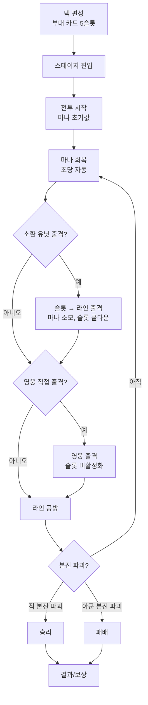

# 전투 코어

[← README로 돌아가기](../README.md)

> 본 문서는 Fantasy Tower Defence의 전투 정체성을 정의하는 **기준 문서**입니다. 기존 방어형/배치형 타워디펜스 서술과 충돌하는 부분은 이 문서를 따릅니다.

---

## 1. 정의: 공방형 라인 디펜스 RPG

- 본 게임의 전투는 **공방형 라인 디펜스 RPG**다.
- 단순한 방어형 타워디펜스(웨이브 막기)가 아니라, **양측이 본진을 보유한 상태에서 라인을 따라 부대를 보내 적 본진을 파괴하는 공방전**이다.
- 플레이어는 영웅과 소환 유닛으로 구성된 부대 카드를 통해 라인을 공략하고, 동시에 자기 본진을 방어한다.

### 1.1 에르엘 워즈 재해석 방향

- 자동 라인 진행, 마나 기반 출격, 본진(성/타워) 파괴 승리 조건은 **에르엘 워즈 계열의 라인 RTS 구조**를 차용한다.
- 다만 다음 항목은 **본 게임 고유 색**으로 재해석한다.
  - 영웅이 부대 카드의 중심이며, 슬롯과 1:1로 묶인다.
  - 영웅은 평시에는 후방 지원, 결단 시 직접 출격이라는 **이중 운용**을 가진다.
  - 소환 유닛은 영웅과 묶여 의미를 가지며, 단순 병종 카드가 아니다.

---

## 2. 전투 기본 목표

| 구분 | 조건 |
|------|------|
| **기본 승리** | 적 본진 파괴 |
| **기본 패배** | 아군 본진 파괴 |
| **시간 초과** | 스테이지별 별도 규칙로 정의 (기본은 무승부 또는 본진 잔여 HP 비교, 추후 결정) |

### 2.1 방어 전용 모드 분리

- 일부 컨텐츠(예: 거점 방어, 최후 방어전)는 본 코어와 별개의 **방어 전용 모드**로 격리한다.
- 방어 전용 모드는 본 코어의 규칙(적 본진 파괴 승리)을 따르지 않으며, 별도 모드 문서에서 정의한다.
- 본 문서가 정의하는 "전투"는 별도 표기 없을 시 공방형 라인 전투를 의미한다.

---

## 3. 라인 구조

### 3.1 기본안

- **지상 2라인 + 공중 1라인** 구성을 Phase 1 기본안으로 둔다.

```
[공중 라인] ═══════════════════════════════════════
[지상 상]   [아군 본진] ──────────────── [적 본진]
[지상 하]   [아군 본진] ──────────────── [적 본진]
```

- 모든 라인은 양방향이며, 각 라인 끝에 양측 본진이 존재하는 형태로 표현된다.
- 라인 간 이동은 기본 불가, 일부 영웅/스킬만 라인 이동을 허용할 수 있다(추후 결정).

### 3.2 변경 가능성 (메모)

- "지상 2 + 공중 1"은 Phase 1 검증용 기본값이다. 다음 변형은 후속 단계에서 재검토한다.
  - 지상 3라인 (공중 제외)
  - 지상 1 + 공중 1 단순화
  - 스테이지별 라인 수 가변

---

## 4. 본진 / 성벽 개념 재정의

기존 문서의 "성벽 = 최종 방어선, 내구도 0이면 패배"라는 서술은 본 코어에서 다음과 같이 재정의된다.

| 구개념 | 신개념 |
|--------|--------|
| 성벽 (방어선) | **아군 본진** (라인의 끝, 파괴 시 패배 조건) |
| 적 출현 지점 | **적 본진** (라인의 끝, 파괴 시 승리 조건) |
| 성벽 내구도 | **본진 HP** (양측 동일 구조, 적도 본진 HP 보유) |
| 성벽 무기 | 본진 부속 자동 공격(있을 수 있음, Phase 1에서는 보류) |

- 즉 "성벽"은 일방적으로 막아내는 방어선이 아니라, **양측이 동일한 구조로 보유한 공격 목표**다.

---

## 5. 전투 자원: 마나

- 전투 중 소환 유닛을 출격시키는 유일한 비용 자원은 **마나**다.
- 마나는 전투 시작 시 일정 값으로 시작해 시간에 따라 자동 회복된다.
- **영지 업그레이드**로 최대 마나 / 회복 속도 / 초기 마나를 강화할 수 있다.
- 영웅 직접 출격의 마나 소모 여부는 [부대 카드 시스템](부대%20카드%20시스템.md#보류--결정-필요)에서 결정 보류.

> 마나 수치 테이블은 기존 [스테이지 시스템](스테이지%20시스템.md#마나-수치-기본값)을 임시 참고하되, 공방형 구조에 맞게 재밸런싱 대상이다.

---

## 6. 전투 흐름



### 6.1 단계 요약

1. **덱 편성**: 부대 카드 5슬롯 구성 (영웅 + 소환 유닛 묶음).
2. **스테이지 진입**: 맵, 라인, 적 본진 위치, 적 스폰 패턴 로드.
3. **전투 시작**: 초기 마나 부여, 마나 회복 타이머 시작.
4. **마나 회복 → 소환 유닛 출격**: 슬롯 메인 버튼으로 해당 라인에 유닛 출격.
5. **영웅 직접 출격 판단**: 위기/공세 타이밍에 영웅을 슬롯에서 꺼내 라인에 직접 투입.
6. **라인 공방**: 양측 유닛이 라인에서 충돌, 본진까지 진행.
7. **본진 파괴 / 방어**: 승패 결정.
8. **결과/보상**: 별 평가, 보상 정산.

### 6.2 영웅 직접 출격 상세

- 영웅 직접 출격의 슬롯 비활성화 규칙, 귀환/전투불능 처리, 비용 정책은 [부대 카드 시스템](부대%20카드%20시스템.md)에서 정의한다.
- 본 문서는 "영웅 직접 출격은 부대 카드 운영의 일부"라는 점만 명시한다.

---

## 7. 기존 문서에서 대체해야 할 표현 목록

새 기준 문서가 만들어진 이상, 기존 문서의 다음 서술은 **공방형 라인 디펜스 정의에 맞춰 재서술**이 필요하다. (본 PR에서는 삭제하지 않고, 후속 PR에서 정리한다.)

| 대상 표현 | 출처 예시 | 대체 방향 |
|-----------|-----------|-----------|
| 성벽 내구도 중심 승패 | [스테이지 시스템 - 승리/패배 조건](스테이지%20시스템.md#승리패배-조건) | "적/아군 본진 HP 0" 기준으로 재서술 |
| 배치 포인트 중심 전투 (◇/◆ 슬롯) | [스테이지 시스템 - 배치 포인트](스테이지%20시스템.md#배치-포인트) | 라인 단위 출격으로 재서술, 포인트형 배치는 방어 전용 모드로만 한정 |
| 웨이브 전멸만으로 클리어 | [스테이지 시스템 - 전투 단계](스테이지%20시스템.md#전투-단계) | 본진 파괴를 기본 클리어 조건으로 재서술 (웨이브 전멸은 미니 목표) |
| 영웅 무료 배치(마나 0, 쿨타임만) | [영웅 시스템 - 배치 시스템](영웅%20시스템.md#배치-시스템) | 영웅은 슬롯에 묶인 부대 카드의 일부로 재정의, 직접 출격은 부대 카드 시스템 규칙을 따름 |
| 핵심 컨텐츠 - 스테이지 클리어의 "마나로 유닛 배치" 단일 서술 | [핵심 컨텐츠 - 스테이지 클리어](핵심%20컨텐츠.md#2️⃣-스테이지-클리어-stage-clear) | 부대 카드(영웅+소환 유닛)로 라인 공방을 수행한다는 서술로 보강 |

---

## 8. 보류 / 결정 필요

- 라인 간 이동 허용 여부 (영웅/스킬 일부 허용?)
- 본진 자동 공격(타워형 무기) 유지 여부, 유지 시 Phase 몇부터인지
- 시간 초과 시 승패 판정 규칙
- 방어 전용 모드 사양 및 본 코어와의 분리 시점
- 스테이지별 라인 수 가변 허용 시점

---

## 9. 관련 문서

- [부대 카드 시스템](부대%20카드%20시스템.md) - 슬롯/영웅 출격 규칙 (Canonical)
- [Phase 1 구현 범위](Phase%201%20구현%20범위.md) - Phase 1 포함/제외 범위 (Canonical)
- [스테이지 시스템](스테이지%20시스템.md) - 기존 방어형 서술, 대체 대상
- [영웅 시스템](영웅%20시스템.md) - 기존 영웅 배치 서술, 대체 대상
- [핵심 컨텐츠](핵심%20컨텐츠.md) - 게임 컨텐츠 위계
